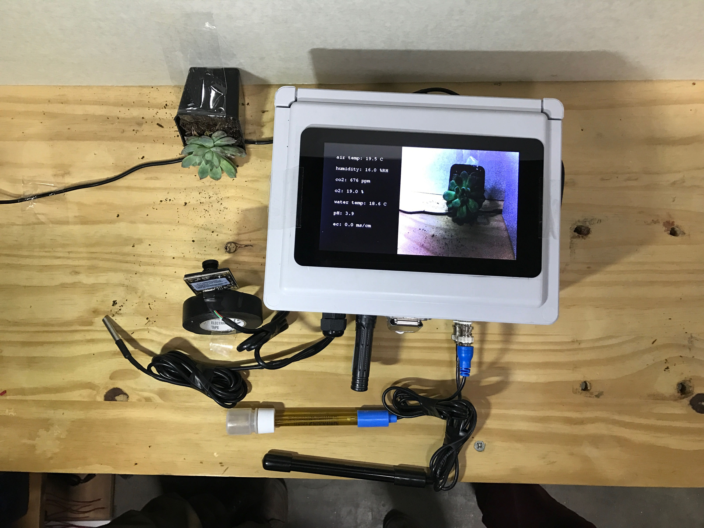

# Brain Box Prototype

The Brain Box Prototype's hardware features a raspberry pi with a 7" multipoint touch screen, high resolution camera, relay board for connecting multi-spectral leds, sensors for air temperature, humidity, co2, o2, water temperature, ph, and ec - all packed into a rugged encolsure.

## Repo Contents
1. [Prototype Software Installation Instructions](./prototype_software_installation_instructions.md)
2. [Prototype Wiring Instructions](./prototype_wiring_instructions.md)
3. [The README from the Brain Box Proof of Concept](./proof_of_concept_readme.md)
