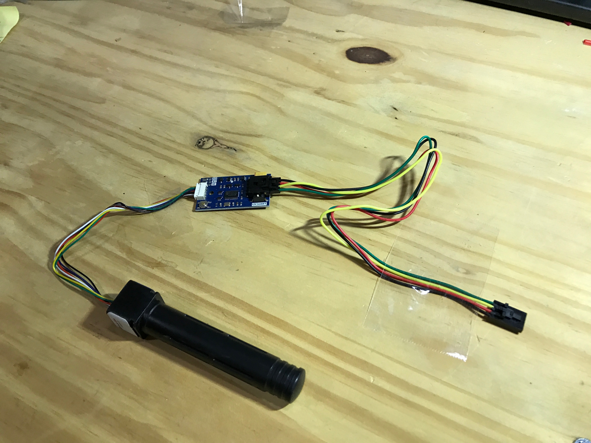
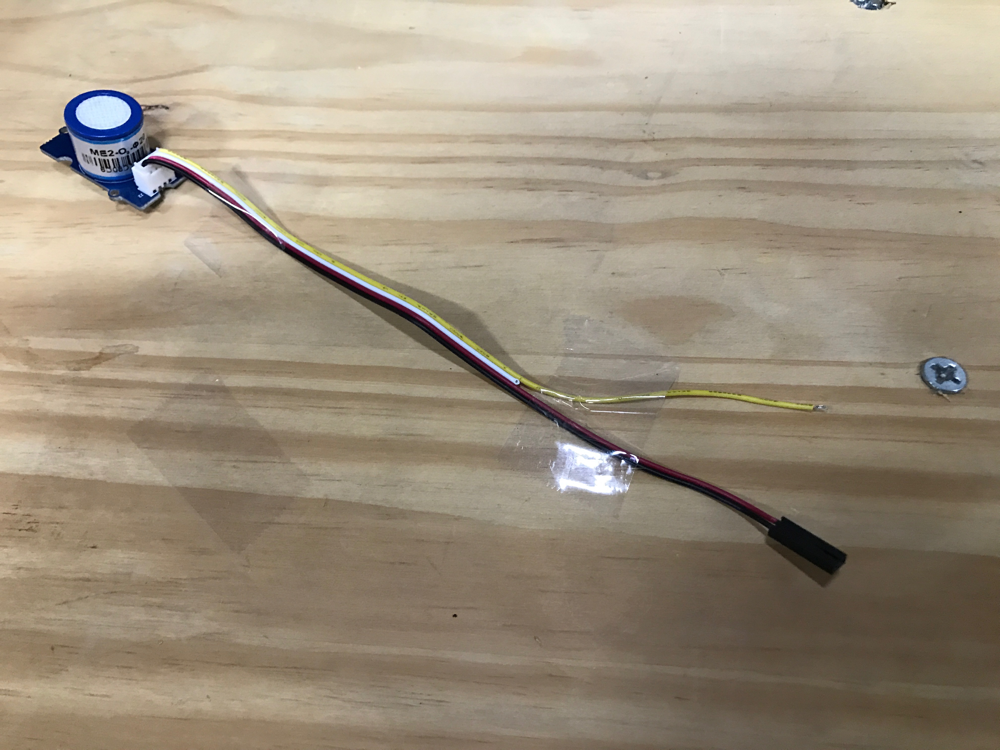
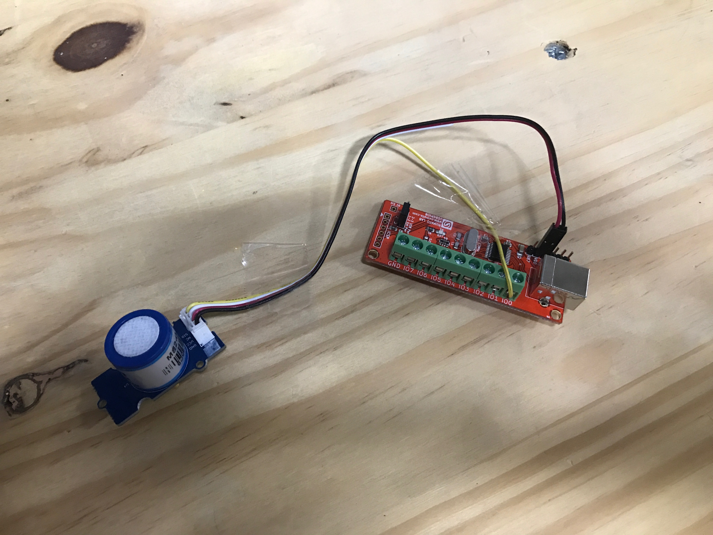
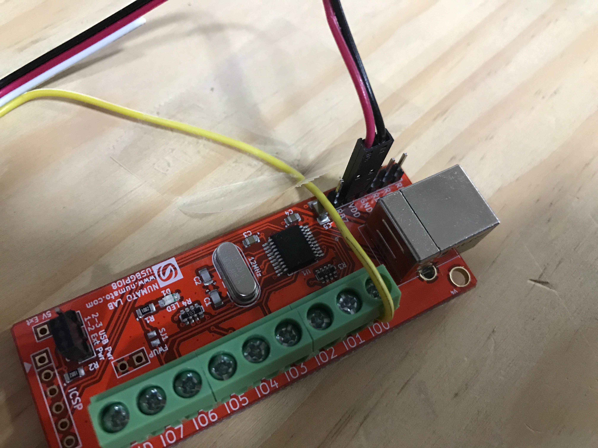
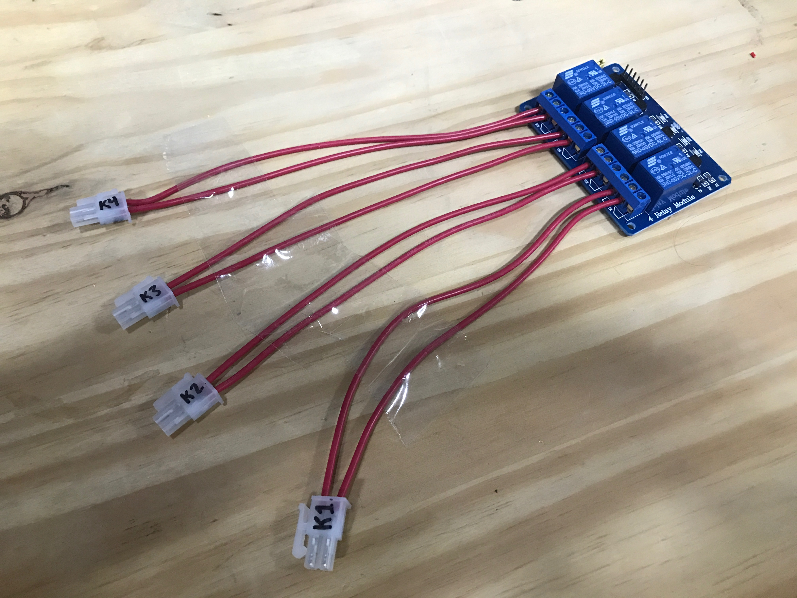
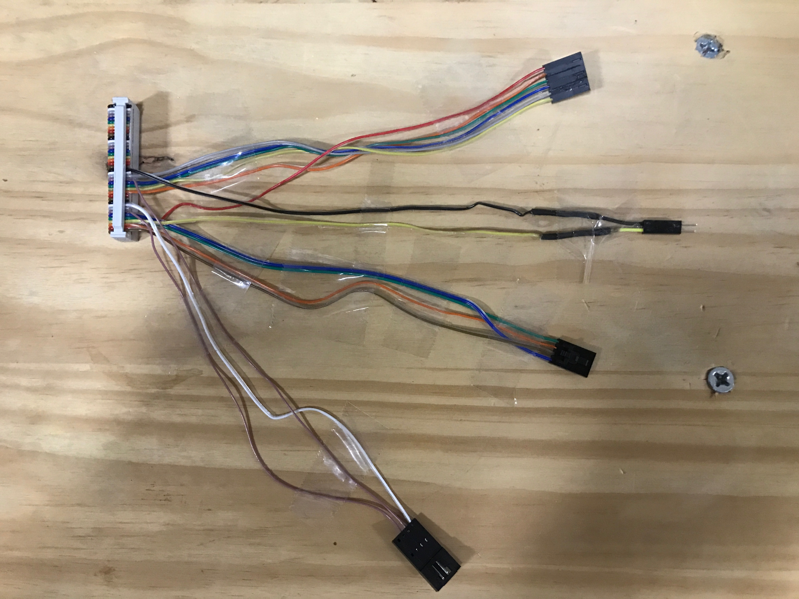
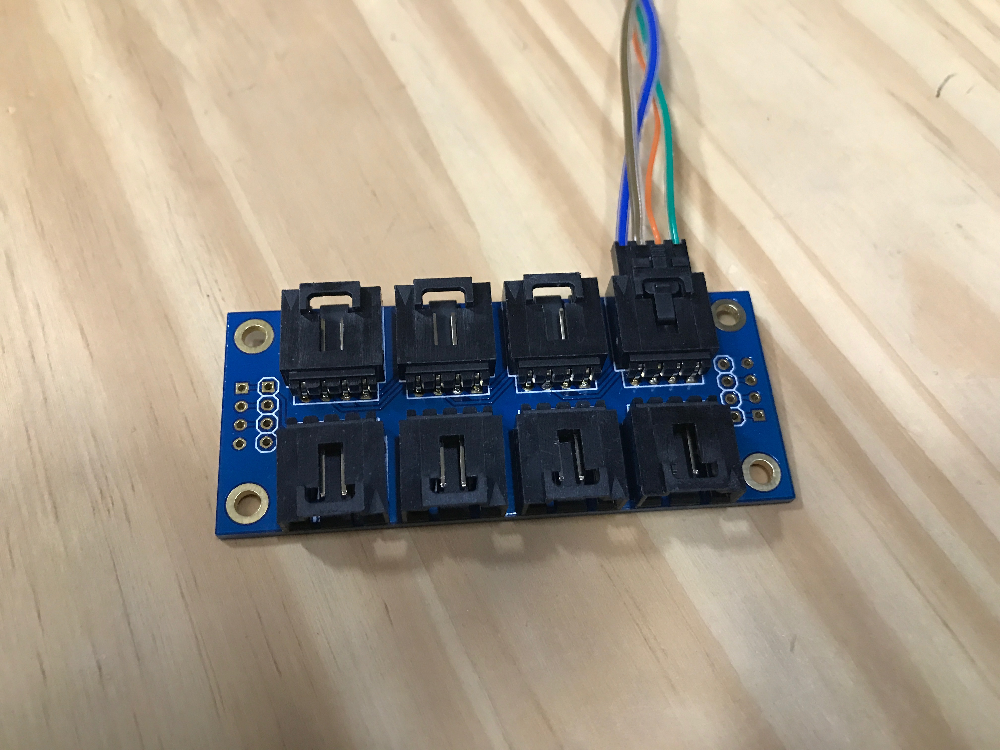
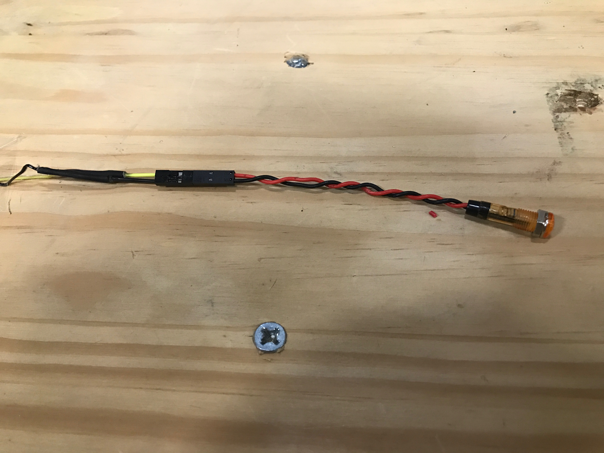
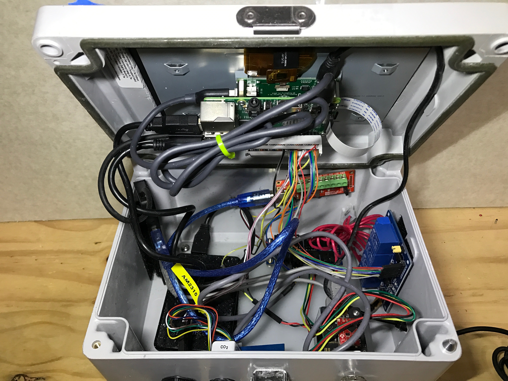

# Prototype Wiring Instructions

## Connectorize the AM2315 Temperature & Humidity Sensor

-------------------------------------------------------

## Connectorize the MHZ16 CO2 Sensor

-------------------------------------------------------

## Connectorize the Grove O2 Sensor

## Connect Grove O2 Sensor to USB GPIO Board

-------------------------------------------------------

## Connectorize the Relay

------------------------------------------------------

## Connectorize the IDC Cable

### IDC Cable 4-Conn Female

### IDC Cable 4-Conn Male

### IDC Cable 2-Conn

### IDC Cable 6-Conn

-------------------------------------------------------

## Connect IDC Cable to Components

### IDC Cable to I2C Extender

### IDC Cable to DS18B20

### IDC Cable to Relay

### IDC Cable to LED

-------------------------------------------------------

## Connect all of the Remaining Components

